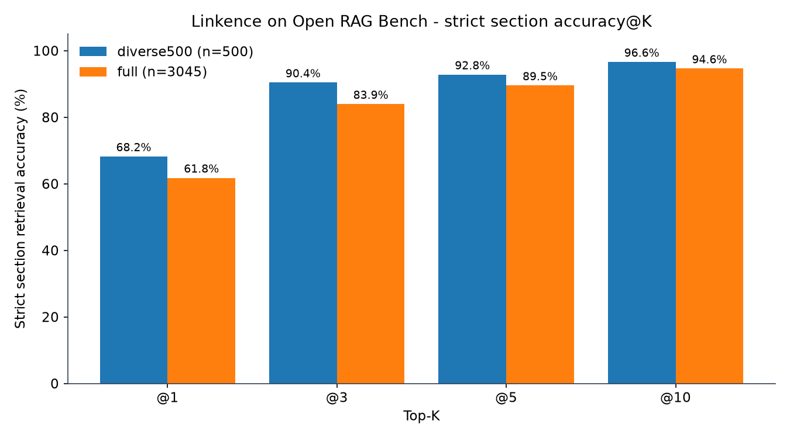

# Linkence Benchmarks

Open, independently verifiable retrieval benchmarks for the **Linkence** RAG engine.

This repository exists for one reason: so that anyone can **check our accuracy numbers
themselves**. We publish the full per-query results, the aggregate metrics, and a
small pure-Python script that recomputes every headline figure straight from the raw
results — no API keys and no access to the Linkence engine required.

## Headline result — Open RAG Bench

| Run | Queries | Strict section acc@10 | Relaxed doc acc@10 | MRR@10 | p50 latency |
|-----|--------:|----------------------:|-------------------:|-------:|------------:|
| `diverse_500` (stratified sample) | 500 | **96.6%** | 99.8% | 0.795 | 387 ms |
| `full` (all valid queries) | 3045 | **94.6%** (96.9% @20) | 99.7% | 0.737 | 419 ms |

*Dataset: [`vectara/open_ragbench`](https://huggingface.co/datasets/vectara/open_ragbench).
"Strict section" = the exact gold section was retrieved; "relaxed doc" = the correct
source document was retrieved. These runs used Linkence's hybrid retrieval (lexical hashed
TF-IDF + OpenAI `text-embedding-3-small` dense embeddings) and no reranker — see each
`manifest.json` for the full config.*



## Verify it yourself in ~10 seconds

The verifier is standard-library only. Clone and run:

```bash
python scripts/compute_metrics.py results/open_ragbench_diverse500/retrieval_results.jsonl \
  --check results/open_ragbench_diverse500/metrics.json
```

It recomputes accuracy@K, MRR, nDCG, and latency percentiles from the raw per-query
JSONL and asserts they match our published `metrics.json`:

```
OK: recomputed metrics match results/open_ragbench_diverse500/metrics.json within tolerance.
```

You are checking *our claim against our raw data* — if the numbers were inflated, this
command would fail.

## Repository layout

```
Linkence-Benchmarks/
├── README.md
├── LICENSE                       # MIT (code) + data attribution note
├── requirements.txt              # only matplotlib, only for the optional chart
├── leaderboard.csv               # one row per run, generated from results/
├── assets/
│   └── accuracy_chart.png        # generated from the verified metrics
├── scripts/
│   ├── compute_metrics.py        # recompute + verify metrics from JSONL (stdlib only)
│   ├── make_leaderboard.py       # results/*/metrics.json -> leaderboard.csv
│   └── make_chart.py             # results/*/metrics.json -> assets/accuracy_chart.png
└── results/
    ├── open_ragbench_diverse500/
    │   ├── retrieval_results.jsonl  # per-query top-K results (the raw proof)
    │   ├── per_query.csv            # one row per query, human-readable verdict
    │   ├── metrics.json             # aggregate metrics (overall + by source/type)
    │   ├── manifest.json            # run config: seed, top_k, model, commit, timestamp
    │   ├── queries.jsonl            # the exact evaluated query set
    │   ├── indexed_docs.json        # the indexed corpus (positives + hard negatives)
    │   ├── summary.md               # human-readable report + failure analysis
    │   └── failures.md              # every missed query, with diagnosis
    └── open_ragbench_full/          # same layout, all 3045 valid queries
```

## Metric definitions

For each query we know the gold `(document, section)`. Given the top-K retrieved units:

- **Strict section accuracy@K** — the gold `(doc_id, section_id)` appears in the top K. This
  is the headline metric and the strictest one: right document *and* right section.
- **Relaxed document accuracy@K** — the gold `doc_id` appears in the top K (any section).
- **MRR@10** — mean reciprocal rank of the first strict section hit within the top 10.
- **nDCG@10** — binary, single-relevant nDCG over the strict section hit.
- **Zero-source rate** — fraction of queries that returned no results at all.
- **Latency p50/p95/p99** — per-query wall-clock retrieval latency.

`per_query.csv` exposes the per-query verdict directly, so you can recompute any of these
with a one-line `groupby` in pandas/Excel:

```
strict section acc@10 == mean(per_query.csv["matched_section"])
```

## Important : 

We report the things that usually get hidden:

- **Multimodal is reported separately, not hidden in the headline.** Images are indexed as
  base64 with no OCR/captions, so our text-embedding stack cannot read image content.
  Text + table queries (the "supported" set) score higher than image-bearing queries; both
  are broken out in each `summary.md`. We do not silently drop the harder queries.
- **Every failure is published.** See `failures.md` in each run — all missed queries with a
  diagnosis (`wrong_doc`, `right_doc_wrong_section`, etc.).
- **Hard negatives are in the index.** The corpus includes hard-negative documents
  (`indexed_docs.json`), not just the gold documents, so retrieval is not trivially easy.

## Reproducing the results

There are two tiers, depending on how far you want to go.

**Tier 1 — verify our metrics from the published results (no engine, no keys).**
This proves the reported accuracy follows from the raw per-query data:

```bash
python scripts/compute_metrics.py results/open_ragbench_full/retrieval_results.jsonl \
  --check results/open_ragbench_full/metrics.json
```

**Tier 2 — re-run retrieval end to end against Linkence.**
This regenerates `retrieval_results.jsonl` by indexing the corpus and issuing every query
against a Linkence instance. It requires access to the engine; see `manifest.json` for the
exact run configuration (random seed, `top_k`, embedding model, chunking strategy, and the
`code_commit_sha` the run was produced from). Reach out if you want to run this tier.

### Results JSONL schema (the harness contract)

Any retriever can be evaluated by these scripts if it emits one JSON object per line in this
shape, then run `compute_metrics.py` over it:

```json
{
  "query_id": "…",
  "query": "…",
  "query_type": "abstractive | extractive",
  "query_source": "text | text-image | text-table | text-table-image",
  "gold_doc_id": "2404.08757v2",
  "gold_section_id": 1,
  "results": [
    {"rank": 1, "returned_doc_id": "…", "returned_section_id": 6, "score": 0.5, "is_hard_negative": false}
  ],
  "latency_ms": 930.1,
  "zero_sources": false
}
```

## Dataset and citation

- Benchmark dataset: [`vectara/open_ragbench`](https://huggingface.co/datasets/vectara/open_ragbench)
- Source documents: arXiv papers (held by their original authors).

If you reference these results, please cite this repository and the Open RAG Bench dataset.
